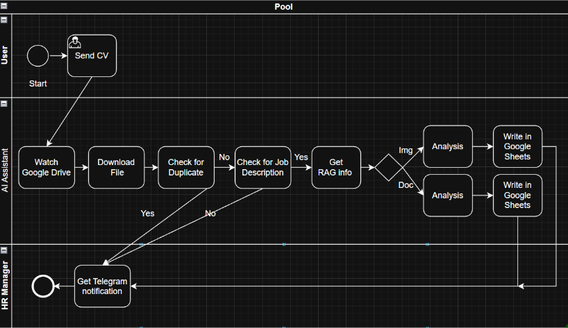
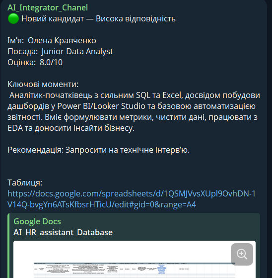
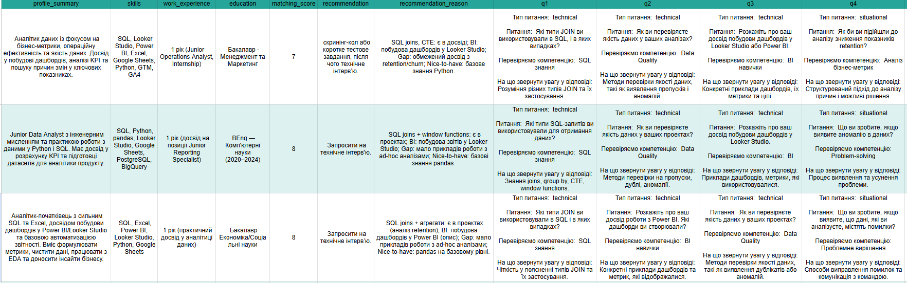

# 🤖 AI Resume Screening & Candidate Evaluation Agent  

---

## 📋 Overview  
This project demonstrates an **AI-powered recruitment assistant** designed to automate resume screening and candidate evaluation.  

The system transforms unstructured CVs into structured data, compares candidates against job requirements, and generates personalized interview questions.  

The solution helps reduce manual screening time by up to **70–90%**, while improving consistency and decision-making quality.  

The analysis includes:  
- Automated **resume parsing and data extraction**  
- Candidate-to-job **matching and scoring**  
- Generation of **personalized interview questions**  
- Storage of structured results for further analysis

---  

## 🖼 Project Preview  

  

  

---  

## 🛠 System Workflow  

1. **Data Collection & Processing**  
   - Resumes are uploaded via **Google Drive**  
   - Files (PDF, DOCX, images) are converted into text  

2. **AI Analysis**  
   - **OpenAI GPT** extracts candidate data  
   - Identifies skills, experience, and key signals  

3. **Evaluation & Scoring**  
   - Candidates are compared against job requirements  
   - Uses structured scoring and semantic matching  

4. **Output Generation**  
   - Candidate summary  
   - Fit analysis  
   - Interview questions  

5. **Reporting & Notifications**  
   - Results stored in **Google Sheets**  
   - HR notified via **Telegram Bot**  

---  

## 📈 Key Features  

- Automated CV parsing  
- AI-powered candidate scoring  
- Interview question generation  
- Real-time HR notifications  
- Structured reporting in Google Sheets  
- Scalable architecture for multiple vacancies  

---  

## 📊 Business Impact  

- ⏱ **Up to 90% reduction** in resume screening time  
- 💰 **€2,500–3,000/month savings per recruiter**  
- 📈 **ROI > 2500%**  
- 🎯 More consistent and objective hiring decisions  

---  

## 🧰 Tools Used  

- **OpenAI GPT** — NLP & resume analysis  
- **Make (Integromat)** — workflow automation  
- **Pinecone** — vector database & semantic search  
- **Google Drive** — file storage  
- **CloudConvert** — document conversion  
- **Google Sheets** — results database  
- **Telegram Bot** — notifications  

---  

## 🚀 How to Run  

1. Upload resumes to Google Drive  
2. Trigger automation (Make / webhook)  
3. System processes and evaluates candidates  
4. Results appear in Google Sheets  
5. HR receives Telegram notification  

---  
